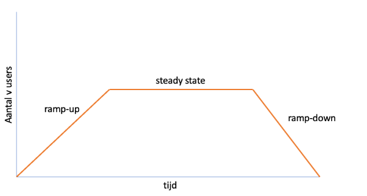
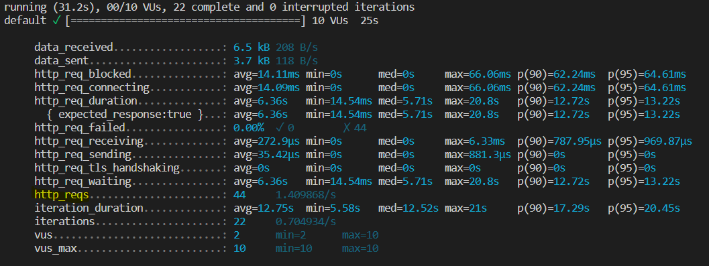
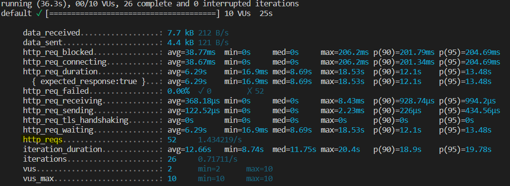
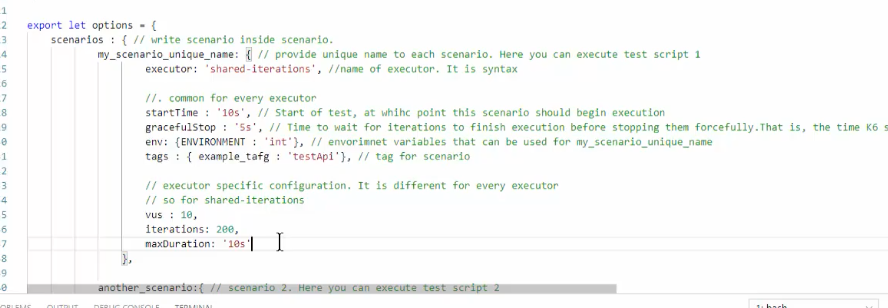
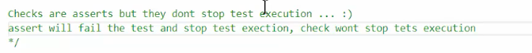
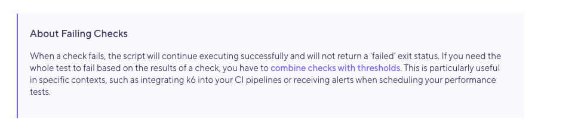
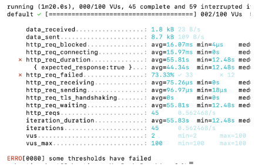

# Stappenplan

## Stap 1 - eerste testscript
We beginnen eenvoudig om te valideren of k6 goed werkt en alles goed is ingesteld. We gebruiken in de eerste test Google, omdat we hiervan zeker weten dat Google een response teruggeeft.

### 1a) Test Google
Maak lokaal een testscript aan, op je laptop, dat een http call doet naar https://www.google.nl.

Om het script op een goede manier op te zetten, begin je met het importeren van de http library in de init-sectie. Daarna maak je een default function en gebruik je de http.get() functionaliteit om een HTTP-request te doen. Het script hoeft alleen een init-sectie en een default-sectie te bevatten.

Als je klaar bent met het script, voer het script uit via de command line (CLI), zoals hieronder staat beschreven. 

```bash
k6 run foo.js
```
[Hulp nodig?](https://danielvanbavel.github.io/k6-workshop-api-docs/docs/k6)

### 1b) Test RPi
De tweede test is dezelfde test als de eerste test. Het enige verschil is dat de URL van Google wijzigt naar een URL van de Raspberry Pi (RPi). Gebruik hiervoor het IP-adres op het informatieblad bij de RPi met het demo endpoint. Voer het script nu nogmaals een keer uit met onderstaand commando.

```bash
k6 run foo.js
```


## Stap 2 - vusers & duration
Virtuele gebruikers (in performancetestjargon vusers, spreek uit ‘v users’) worden in een performancetest gebruikt om gebruikersbelasting te simuleren. De gebruikersbelasting die wordt gesimuleerd door de vusers is bijvoorbeeld 100 keer inloggen in een minuut of het bevragen van een API-endpoint. In k6 worden vusers aangegeven met de parameter ‘vus’.

Duration is bedoeld om de performancetest een bepaalde tijd te laten duren. Wanneer je geen duration meegeeft in de performancetest zal de test stoppen zodra alle requests zijn gedaan.

Vusers en duration kunnen op twee manieren gebruikt worden in de test. Manier één is via het commando in de CLI. Manier twee is in het script met de options function. In deze stap gaan we beide manieren toepassen. Voordat we beginnen is het goed om te weten hoe deze parameters gebruikt worden.

Beide parameters worden anders gedefinieerd. De parameter ‘vus’ is een integer zoals 10, 20, 30. Duration wordt uitgedrukt in tijd, dus het aantal seconden, minuten of uren (10s, 8m, 1h).


### 2a) CLI
Verander het commando uit de vorige opdracht naar een commando waarbij de parameters 'vus' en 'duration' worden meegegeven in de CLI en herhaal de test.

```bash
k6 run --vus [aantal vusers] --duration [tijdsduur] [scriptnaam].js
```

### 2b) options function
Om als ontwikkelaar meer controle te hebben, is het wenselijk om de opties zoals vusers en duration te verwerken in het script in plaats van het CLI-commando. Wanneer de parameters verwerkt worden in het script, kan het onderdeel worden van versiebeheer.

In k6 is het verschil tussen duration in de CLI en in de options function, dat duration in de options function als string wordt geschreven.

Verwerk nu in de options function vus en duration. 

De options function ziet er als volgt uit.
```javascript
export const options = {
  vus: [AANTAL V-USERS],
  duration: '[TESTDUUR]'
}
```

### 2c) Stages
Er bestaan verschillende soorten performancetest die verschillende doelen dienen, zoals een stresstest of een duurtest. In de meeste gevallen wil je de belasting (load) geleidelijk opbouwen om je systeem een opwarmtijd te geven en om een realistischer scenario te simuleren. Ook kun je de load weer netjes afschalen richting het einde van de test.



In k6 heet een fase met andere load een ‘stage’. Het totaal van alle stages wordt in performancetestjargon een loadmodel genoemd. Op de afbeelding hierboven staat een loadmodel afgebeeld met drie stages.

Voeg drie stages toe aan je script met verschillende load en duration. Let op, aantal vusers wordt hier 'target' genoemd.

Doe bijvoorbeeld: 
- opbouw 10s, 20 vus
- Load 20s, 20 vus
- Afbouw 10s, 0 vus

```javascript
stages:
[
  { duration: '[TESTDUUR]', target: [AANTAL V-USERS] },
  { duration: '[TESTDUUR]', target: [AANTAL V-USERS] },
  { duration: '[TESTDUUR]', target: [AANTAL V-USERS] },
],
```

Standaard begint k6 bij het uitvoeren van de eerste stage met opbouwen vanaf 1, binnen de duration naar de target vusers. Wil je dit veranderen dan kan dat met de optie startVUs. [ramping vusers](https://k6.io/docs/using-k6/scenarios/executors/ramping-vus)

## Stap 3 - monitoring en rapportage

### 3a) monitoring
Als je een performancetest uitvoert wil je vaak weten hoe de test verloopt. Hievoor richt je monitoring in.

Tijdens een testrun zie je wat je test doet in de terminal, dit is de client-side. De client-side monitor je om het verloop van je test in de gaten te houden. Het geeft antwoord op de vraag ‘doet mijn performancetest wat ik bedoeld had’. 

De server-side kun je monitoren via het Grafana-dashboard wat is [uitgelegd in de introductie](https://danielvanbavel.github.io/k6-workshop-api-docs/docs/intro). Server-side monitor je om te zien hoe het SUT (System Under Test) zich houdt tijdens de performancetest. Het geeft antwoord op de vraag ‘hoe houdt het testobject zich tijdens deze performancetest?’.

Voer verschillende testruns uit waarbij je de waardes van het aantal vusers en de duration iedere testrun verandert. Blijf goed monitoren tijdens de test om te kijken wat er gebeurt.

### 3b) rapportage
Een rapportage is handig om achteraf te kunnen bepalen hoe de test verliep. Zoals je misschien is opgevallen, worden de testresultaten van k6 gelogd in de terminal. Dit is niet ideaal, omdat resultaten in de terminal niet worden opgeslagen. Daarom wil je dit het liefst in een testrapport opslaan, zodat je de resultaten later nog eens kunt terugkijken.

Standaard biedt k6 niet de mogelijkheid om na de test een report te maken. Echter, zijn er wel uitbreidingen beschikbaar. Deze uitbreiding gaan we toevoegen in het script.

Volg de stappen in de [GitHub repository](https://github.com/benc-uk/k6-reporter) voor het maken van een testrapport.

## Stap 4 - aantal requests in plaats van testduur
Meestal voer je een performancetest uit met als doel om een productiesituatie te simuleren, bijvoorbeeld tijdens piekuren heeft dit endpoint 50 requests per minuut te verduren.

Hieronder staan de resultaten van drie testruns van exact hetzelfde script.




Zoals je kunt zien, is het totaal aantal http_requests bij elke testrun verschillend. Dit heeft te maken met de responstijd. Hoe sneller het testobject een response teruggeeft, hoe meer http requests verwerkt kunnen worden. Verschillende factoren, zoals verbindingssnelheid, kunnen ervoor zorgen dat de responstijden variëren gedurende een test. Hierdoor varieert de doorvoersnelheid (throughput) en dit resulteert in dat performancetests zijn uitgevoerd met een verschillende hoeveelheid load.

Maar zoals geschetst in de eerste zin, voer je vaak een performancetest uit om te verifiëren of je testobject een bepaalde load aankan. Je kan hierbij dus niet kunt vertrouwen op alleen duration omdat je geen controle hebt over het aantal requests dat er gedaan wordt.

In k6 kan je het beoogde aantal requests instellen met de parameter ‘iterations’.

Belangrijk om eerste te weten is dat in k6 de mogelijkheid bestaat om het totaal aantal iteraties te bepalen, de zogenaamde shared iterations. Daarentegen is het ook mogelijk om per vuser het aantal iteraties bepalen, dit heet Per VU iterations.

Wanneer je op basis van het aantal iteraties je test opzet, is de parameter duration niet meer nodig, je wacht immers tot alle transacties zijn afgerond. Wel kun je een maxduration instellen om aan te geven hoe lang de test maximaal mag duren.

Scenario’s is een uitgebreide feature van k6. Je kunt hier onder andere een setup bepalen voor meerdere API’s die je aanroept. Bv de ene met 10 vusers en de andere met 100. Als je dit doet zul je ook geen default function meer aanroepen maar de scenario’s apart. 
[Meer weten?](https://k6.io/docs/using-k6/scenarios/advanced-examples)



De iterations is onderdeel van een scenario in het options gedeelte.

Configureer jouw performancetest zo, dat de v-users allen 50x de RPi bevragen tijdens de test.

```javascript
export const options = {
  scenarios: {
    naam_van_scenario: {
      executor: 'per-vu-iterations',
      vus: 10,
      iterations: 50,
      maxDuration: '300s',
    },
  },
};
```
[hulp nodig?](https://k6.io/docs/using-k6/scenarios/executors/shared-iterations)

## Stap 5 - inhoudelijke validatie
Een performancetest heeft, net zoals andere testen, validatie nodig. Je wilt immers zeker weten dat je test daadwerkelijk doet wat je had bedoeld. Soms is een HTTP 200 response namelijk niet voldoende. Doe daarom ook geen aanname dat de test geslaagd is wanneer je tool OK teruggeeft. Een pagina waarop staat dat het inloggen niet is gelukt, bijvoorbeeld omdat het gebruikte wachtwoord onjuist was, geeft namelijk ook een HTTP 200 terug. Hierdoor krijgt de pagina na het inloggen geen load en is je test dus niet geslaagd.

In k6 kan je met checks een request in het script valideren, bijvoorbeeld: 
- Geeft dit request een HTTP 200 status terug.
- Geeft de respons body een specifieke text terug.
- Bevat de respons body een bepaalde grootte.4
- Bevat de respons, na het parsen van de JSON een specifiek element.

Om dit te doen moet je de respons afvangen in een constante. Deze constante verwerk je in de check-functie.

Kies twee of drie verschillende validaties en verwerk deze in je test. Voer daarna de test een aantal keren opnieuw uit om te zien of de validaties werken.

```javascript
import http from 'k6/http'

export default function() {
    const response = http.get(“http://www.google.nl”)
    check(response, {
        'is status 200': (r) => r.status === 200,
    });
    // We use ===, so along with 200, it also checks for data type i..e number === number, string === string.
    //expected and actual data type as well as value has to be the same
}
```
Goed om te weten:
Een check stopt de test niet, zoals een assert zou doen. Als je dat wel wil moet je checks combineren met thresholds


Over gefaalde checks


[Hulp nodig?](https://k6.io/docs/using-k6/checks)

## Stap 6 - automatische testbeoordeling
Na de uitvoer van een performancetest is de eerste vraag waarop je antwoord wil “heeft mijn performancetest gedaan wat ik beoogd had?”. 

Dit kun je automatisch laten valideren in k6 door gebruik te maken van ‘thresholds’ (grenswaarden). Daarnaast zorgen thresholds ervoor dat performancetesten in een pipeline geautomatiseerd worden beoordeeld.

Goed om te weten is dat, wanneer je meerdere thresholds hebt ingesteld en er een FALSE genereert, de hele test wordt beoordeeld als gefaald. Daarnaast kan je ook de output van een check gebruiken als input van een threshold.



In k6 kan je met thresholds je testrun valideren. Voorbeelden hiervan zijn:
- Of het aantal gefaalde HTTP requests kleiner is dan 1%
- Of in 90% van de gevallen het response kleiner is dan 300ms.

De threshold functie kan als bron gebruik maken van de [ingebouwde metrieken](https://k6.io/docs/using-k6/metrics/#http-specific-built-in-metrics) of custom metrieken.
Implementeer twee of meer verschillende thresholds in je script. De thresholds dienen toegevoegd te worden in de options function. Maak voor het gemak gebruik van de [ingebouwde metrieken](https://k6.io/docs/using-k6/metrics/#http-specific-built-in-metrics).

```javascript
thresholds: {
    http_req_failed: ['rate<0.01'], // http errors should be less than 1%
    http_req_duration: ['p(95)<200'], // 95% of requests should be below 200ms
 },
```
[hulp nodig?](https://k6.io/docs/using-k6/thresholds)


## Stap 7 - variabelen en parametriseren
Wanneer het testscript uitgebreider wordt, is het handig om variabelen te gebruiken. Om te zorgen dat het testscript onderhoudbaar blijft, is het een goede gewoonte de variabele waarden, zoals de string het endpoint, te parametriseren.

```javascript
http.get('http://google.com'); 
```
Dit kun je vervangen door

```javascript
http.get(NAAM_VAN_DE_VARIABELE);
```
Deze variabelen kun je vullen vanaf de CLI door het meegeven van een argument aan je runcommando.

```bash
k6 run -e NAAM_VAN_DE_VARIABELE=google.com script.js
```

Daarnaast kun je de variabelen ook invullen door gebruik te maken van een extern configuratiebestand dat je dan importeert in je hoofdscript.

Dit configuratiebestand is ook een JavaScript file en geven we de naam env.js. In dit bestand exporteren we alle variabelen.

Maak een env.js bestand aan in de hoofdmap van je project.

```javascript
export let devEnvironment = "http://www.google.nl"
export let VU=25
export let DURATION="20s"
```

Importeer deze in het hoofd script.

```javascript
import * as env from './env.js'
```
<b>Hoe was het eerst?</b>

```javascript
http.get("http://10.0.0.75:8888/load");
``` 
<b>Hoe schrijf je het nu op?</b>

```javascript
http.get(`${env.VARIABLENAAM}`);
```

Voer de test opnieuw uit. Als je de variabelen goed hebt geparametriseerd, functioneert de test zoals daarvoor.

[Hulp nodig?](https://k6.io/docs/using-k6/environment-variables)


## Stap 8 - modules
Wanneer je bepaalde functionaliteiten herhaaldelijk moet uitvoeren, bijvoorbeeld wanneer je in een scriptrun een API moet aanspreken met verschillende parameters, is het handig om het script modulair op te bouwen met functions en die vervolgens te importeren in je hoofdscript.

In k6 zijn er drie verschillende manieren voor het importeren van modules:
- Ingebouwde modules, dit zijn de modules die verwerkt zitten in de core van k6 zoals de http module.
- Lokale bestandssysteemmodules die jezelf hebt ontwikkeld, zoals de env.js.
- Remote HTTP(S) modules, zoals de module die we geïmporteerd hebben voor het maken van het rapportage.

Bepaal welke onderdelen geschikt zijn om los te trekken die je later kan aanroepen in je hoofdscript en verplaats deze naar een los script. Voer je hoofdscript uit om te kijken of het nog werkt.

```javascript
//helper.js
export function helper() {
}
```
```javascript
//my-test.js
import { someHelper } from './helpers.js';
export default function () {
  someHelper();
}
```

[Hulp nodig?](https://k6.io/docs/using-k6/modules)
