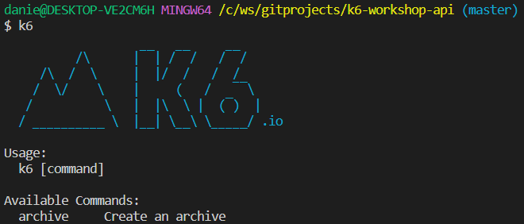

# Introductie
In deze expert workshop gaan we verschillende performancetesten maken en uitvoeren op een Raspberry PI. Op de Raspberry PI is een applicatie geïnstalleerd, daarnaast is er ook een grafana dashboard aanwezig dat een overzicht laat zien van de resources van de Raspberry PI. Per Raspberry PI ligt er een informatie blad met daarop de url's van de applicatie en het grafana dashboard.

Veel plezier!

## Wat heb je nodig
- K6
- Je favoriete IDE
- Internet connectie (Wifi / Kabel), Waarschijnlijk heb je die al anders kon je dit niet lezen.

## K6 installatie
Open je terminal en typ K6 [enter]. Als K6 goed geinstalleerd is, is dit het resultaat

Mocht je K6 nog niet geinstalleerd heb volg dan onderstaande link:

[K6 installatie](https://k6.io/docs/getting-started/installation)

## Hulp nodig?
Wanneer je hulp nodig hebt vraag om hulp bij iemand met een **codecentric shirt**. 
